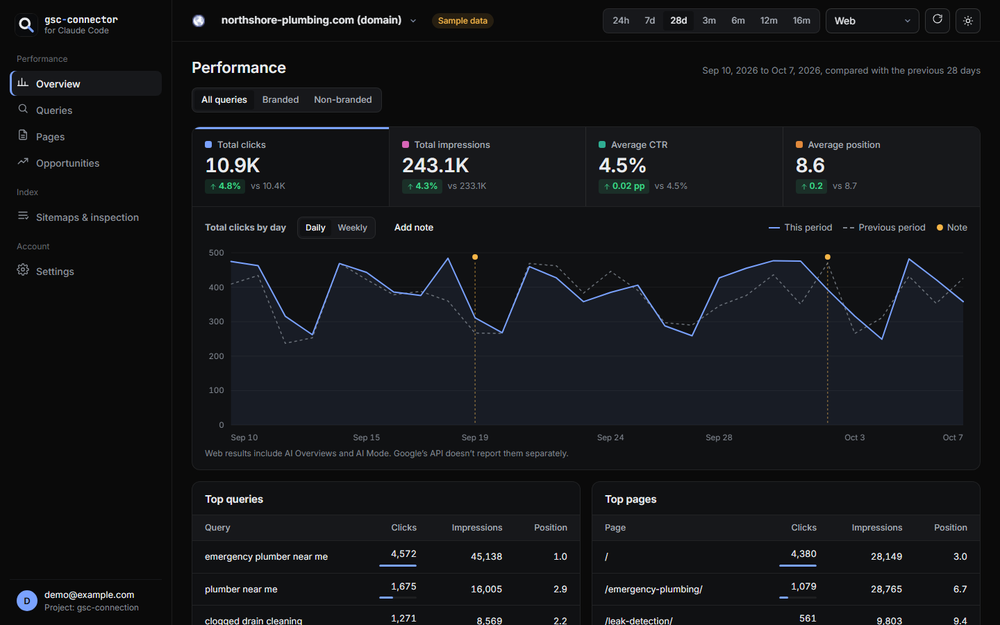
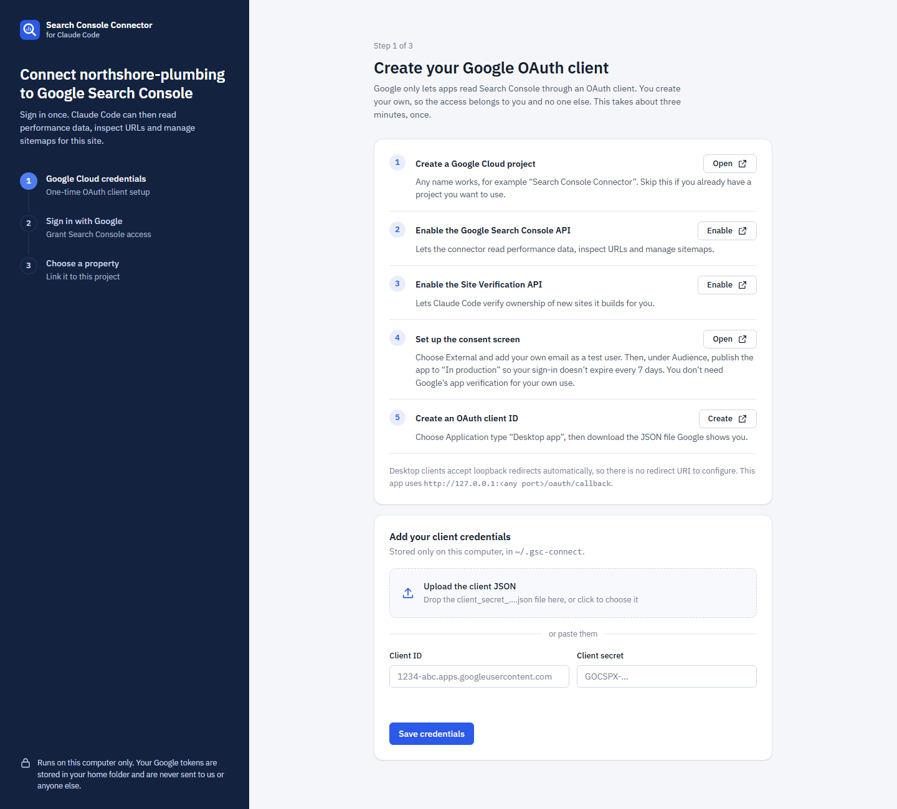
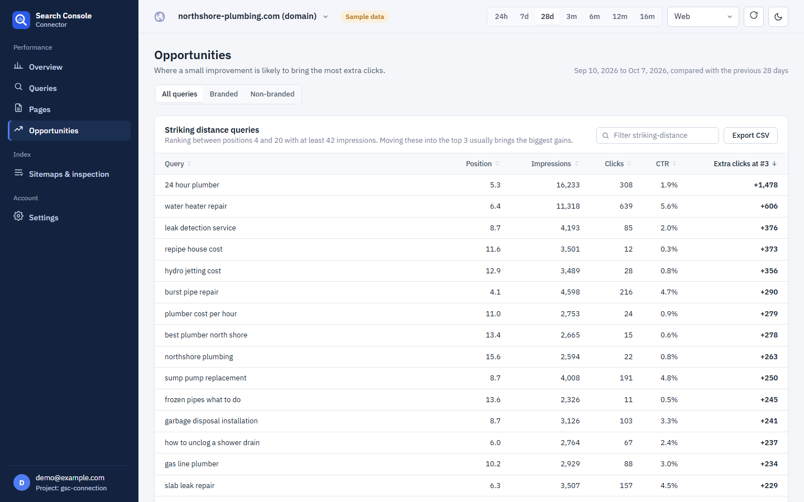
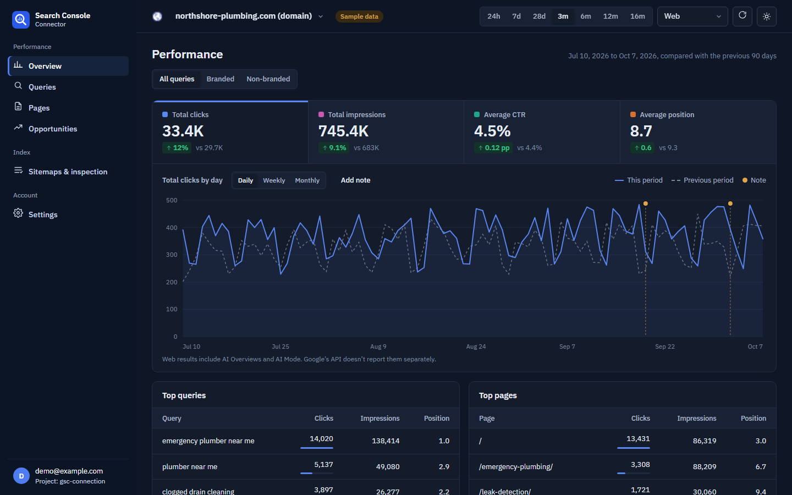
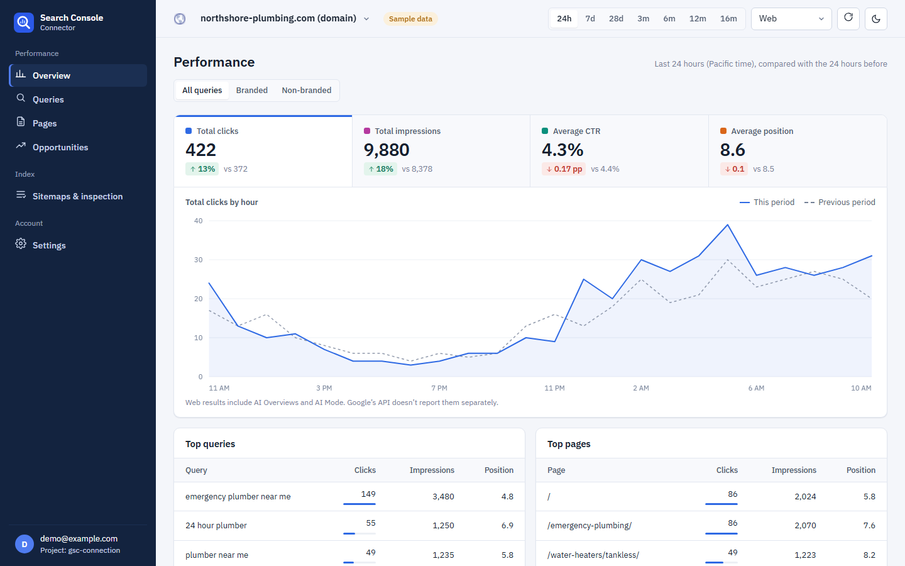
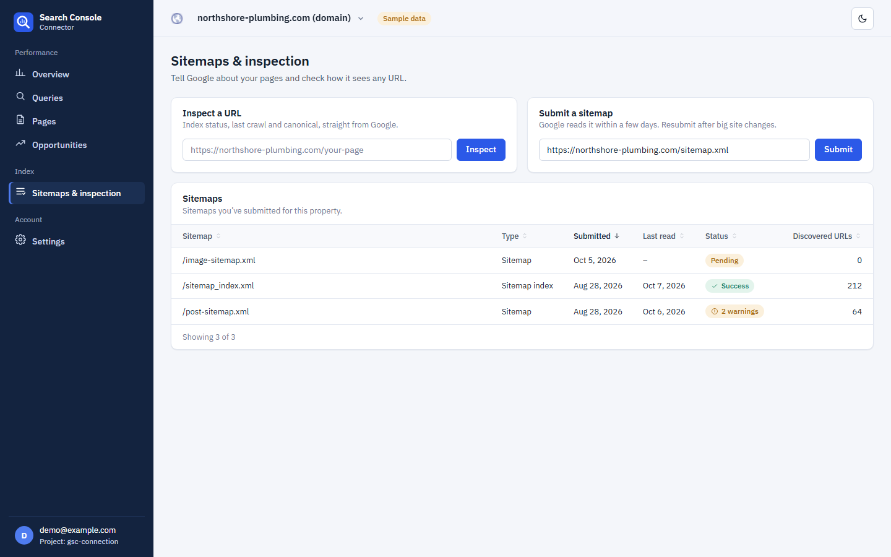

# Google Search Console Connector for Claude Code

Connect any website project to **Google Search Console** from **Claude Code**, Google **Antigravity** or any MCP client. Sign in with your Google account once, then ask Claude about clicks, queries, rankings and indexing, pull every GSC report as CSV with one command, and track it all in a local SEO dashboard.

It's an open-source **Search Console MCP server**, a **GSC report exporter** and a **dashboard**, and it runs entirely on your computer against your own Google Cloud project.

[](https://www.npmjs.com/package/google-search-console-connector)
[](LICENSE)
[](package.json)



**Docs and updates:** [claude-repo.com/google-search-console-connector](https://claude-repo.com/google-search-console-connector)

---

## Why this exists

If you build sites with an AI coding agent, getting Search Console data into it usually means logging in to search.google.com, clicking Export, downloading CSVs and dragging them into the chat. Every site, every time.

This tool removes those steps:

```
npx google-search-console-connector report
```

That one command downloads the same reports as Search Console's Export button (Dates, Queries, Pages, Countries, Devices, Search appearance) plus comparisons with the previous period, query-to-page pairs, sitemaps, and a `summary.md` written for Claude to read. Inside Claude Code you don't even type it. Ask "pull the Search Console report" and Claude runs the `gsc_export_report` tool.

## Features

- **Sign in with Google.** A guided browser flow sets up your Google Cloud OAuth client and signs you in with Google's own OAuth 2.0 (PKCE). No passwords or API keys to paste into chat.
- **One-command GSC export.** Pull CSV, JSON and Markdown reports for one site or all your sites (`--all-sites`), for any range up to 16 months.
- **MCP server for Claude Code and Antigravity.** 18 tools: performance data, hourly data, branded vs non-branded queries, URL Inspection, sitemaps, adding properties and verifying ownership.
- **Local SEO dashboard.** KPIs against the previous period, a trend chart (hourly, daily, weekly, monthly), queries, pages, countries, devices, sitemaps and URL Inspection. Light and dark themes.
- **Opportunities.** Striking-distance keywords (positions 4–20), page-one pages with low CTR, and queries that are losing clicks.
- **Branded vs non-branded.** Set your brand terms once; the dashboard, reports and Claude can all split traffic by them.
- **Chart notes.** Claude can mark the chart when it ships SEO changes ("Rewrote service page titles"), so you can see what moved the numbers.
- **Site verification.** Claude can add a new site to Search Console, put the verification meta tag in your code, and verify it after you deploy.
- **Current with Google.** Supports the latest Search Console API features, including hourly data, Discover and Google News. A weekly check flags new API fields and Search Central announcements.
- **Private by default.** Tokens stay on your machine. Every API call runs on your own Google Cloud project, at your own (free) quota.

## Quick start

You need Node.js 20 or newer and a Google account with access to Search Console.

**1. Add it to Claude Code** (once, for all your projects):

```bash
claude mcp add gsc --scope user -- npx -y google-search-console-connector@latest
```

On Windows, wrap `npx` in `cmd /c`:

```bash
claude mcp add gsc --scope user -- cmd /c npx -y google-search-console-connector@latest
```

To run the latest code straight from GitHub instead of npm, use `npx -y github:malaysherasia-ai/google-search-console-connector-for-claude-code` in place of `npx -y google-search-console-connector@latest`. The first start takes about 20 seconds while it builds.

**2. Connect a website project.** Open Claude Code in the website's folder and say:

> Connect this project to Google Search Console

Claude calls `gsc_connect`, which opens a page in your browser. It walks you through:

1. creating a Google Cloud OAuth client (about three minutes, once),
2. signing in with Google,
3. choosing which Search Console property belongs to this project.

**3. Ask away:**

> How did the site do in the last 28 days?
> Which queries are we ranking 4–20 for, and which pages should we improve?
> Pull the GSC report for the last 3 months.
> Inspect https://example.com/services/ and tell me why it isn't indexed.
> Submit the sitemap, then add a chart note that we launched the new location pages.
> Open the Search Console dashboard.

You can also run everything from a terminal:

```bash
npx google-search-console-connector connect     # browser setup and sign-in
npx google-search-console-connector report      # export reports to .gsc-reports/
npx google-search-console-connector dashboard   # open the local dashboard
npx google-search-console-connector demo        # try the dashboard with sample data
```

## Use with Google Antigravity, Cursor and other MCP clients

Any MCP client that can start a local (stdio) server works. Add this to its MCP configuration (in Antigravity, open the MCP servers settings and edit the raw config):

```json
{
  "mcpServers": {
    "google-search-console": {
      "command": "npx",
      "args": ["-y", "google-search-console-connector@latest"]
    }
  }
}
```

The server uses the folder it is started in as the project. If your client starts servers somewhere else, set `"env": { "GSC_PROJECT_DIR": "/path/to/your/site" }`.

## Google Cloud setup

Google only allows Search Console API access through an OAuth client that you create. The Connect page links you straight to each screen, but here is the whole list:

1. [Create a Google Cloud project](https://console.cloud.google.com/projectcreate), or pick an existing one.
2. Enable the [Google Search Console API](https://console.cloud.google.com/apis/library/searchconsole.googleapis.com).
3. Enable the [Site Verification API](https://console.cloud.google.com/apis/library/siteverification.googleapis.com) (used to verify new sites).
4. [Configure the consent screen](https://console.cloud.google.com/auth/overview): choose **External** and add your email as a test user. Then publish the app to **In production**. Apps left in "Testing" have their sign-in expire every 7 days. You don't need Google's app verification for your own use; Google will show an "unverified app" notice, and you continue with **Advanced → Go to (your app)**.
5. [Create an OAuth client ID](https://console.cloud.google.com/auth/clients/create) of type **Desktop app**, download the JSON, and drop it on the Connect page.

Both APIs are free. Google enforces quotas (for example, 1,200 Search Analytics queries per minute), and all usage counts against your project. Nothing runs through a server of ours.



## One-command Search Console reports

```bash
npx google-search-console-connector report [--days 28] [--type web] [--site URL] [--all-sites] [--out DIR]
```

| File | Contents |
|---|---|
| `summary.md` | Totals against the previous period, branded split, top queries and pages, biggest gains and losses, striking-distance keywords and low-CTR pages |
| `Dates.csv`, `Queries.csv`, `Pages.csv`, `Countries.csv`, `Devices.csv`, `Search appearance.csv` | The same columns as Search Console's Export, plus previous-period columns |
| `Query-page pairs.csv` | Which page ranks for which query (Search Console's UI can't export this) |
| `Sitemaps.csv` | Submitted sitemaps, status, errors and warnings |
| `Filters.csv`, `report.json` | Exactly what was requested, and all data as JSON |

Reports go to `.gsc-reports/<site>/<date>_last-<n>-days/` in your project, and `.gsc-reports/` is added to `.gitignore` so search data never ends up in a commit or a deployed site. Rows page past Google's 25,000-row limit automatically.

## MCP tools

| Tool | What it does |
|---|---|
| `gsc_connect` | Opens the browser Connect flow and waits for it to finish |
| `gsc_status` / `gsc_disconnect` | Connection status; revoke access |
| `gsc_list_sites` / `gsc_link_project` | List properties; set this project's default property |
| `gsc_performance_summary` | Totals against the previous period, plus top queries and pages |
| `gsc_search_analytics` | Any Search Analytics query: dimensions including `hour`, filters (regex), search type, branded/non-branded |
| `gsc_export_report` | The one-command report export, for one site or all sites |
| `gsc_inspect_url` | URL Inspection: index status, last crawl, canonical, rich results |
| `gsc_list_sitemaps` / `gsc_submit_sitemap` / `gsc_delete_sitemap` | Manage sitemaps |
| `gsc_add_site` / `gsc_get_verification_token` / `gsc_verify_site` | Add a property and verify ownership (meta tag, HTML file or DNS) |
| `gsc_set_brand_terms` | Words that make a query "branded" |
| `gsc_add_annotation` | Add a dated note to the performance chart |
| `gsc_open_dashboard` | Open the local dashboard |

## The dashboard

`npx google-search-console-connector dashboard`, or ask Claude to open it. It runs on `127.0.0.1` only and opens through a one-time link.

- **Overview:** clicks, impressions, CTR and position against the previous period, with a trend chart for the last 24 hours (hourly) through 16 months, grouped daily, weekly or monthly
- **Queries and Pages:** sortable, searchable, change columns, CSV export
- **Opportunities:** striking distance, low CTR, declining queries
- **Sitemaps & inspection:** submit sitemaps, check their status, inspect any URL
- **Settings:** account, project property, brand terms, chart notes, usage-metrics choice

| | |
|---|---|
|  |  |
|  |  |

Try it without a Google account: `npx google-search-console-connector demo`.

## What Google's API does and doesn't expose

Search Console keeps adding features. Some reach the API and some stay in the web UI. This table reflects Google's API as of October 2026.

| Search Console feature | Supported here | Notes |
|---|---|---|
| Performance: clicks, impressions, CTR, position by date, query, page, country, device, search appearance | Yes | |
| Hourly data (last ~10 days) | Yes | `hour` dimension, "24h" range in the dashboard |
| Discover and Google News performance | Yes | Google doesn't report queries or positions for these |
| Branded vs non-branded queries | Yes | Built from your brand terms with RE2 regex filters |
| Weekly and monthly views | Yes | Grouped from daily data |
| Chart annotations | Yes, locally | Stored in `.gsc-connect.json`; Google's own annotations aren't in the API |
| AI Overviews and AI Mode | Included in Web totals | Google's API can't separate them |
| Generative AI performance report, web multimodal search type, social platform properties, query groups | Not yet | UI-only in Search Console today. The update check flags them as soon as Google adds them to the API |

## Privacy and anonymous usage metrics

- **Your Search Console data never leaves your computer**, except to go between you and Google.
- **Tokens** are stored in `~/.gsc-connect/` with owner-only file permissions. Disconnecting revokes them at Google.
- **Project settings** (`.gsc-connect.json`: property, brand terms, chart notes) contain no secrets and are safe to commit.
- **Anonymous usage metrics are opt-in.** The first screen asks once. If you say no, nothing is ever sent. If you say yes, the app sends event names such as `view_changed` or `mcp_tool_called` with the app version, operating system and a random install ID to Google Analytics 4 via the Measurement Protocol. It never sends site URLs, page URLs, queries, metrics or your account. No tracking script runs in your browser and no cookies are set. Settings → "What's been sent" shows every event exactly as it was sent, and you can change your answer there at any time. `DO_NOT_TRACK=1` or `GSC_CONNECT_TELEMETRY=0` turns it off for good. The full list of events is in [`src/telemetry.ts`](src/telemetry.ts).
- **Update check:** once a day the app asks the public npm registry for the latest version number. Set `GSC_CONNECT_UPDATE_CHECK=0` to turn it off.

## Security

- The local server listens on `127.0.0.1` only, checks the `Host` header, and requires a session cookie that is set through a one-time launch link.
- OAuth uses the loopback redirect with PKCE (S256) and a `state` check, as Google recommends for desktop apps.
- Requested scopes: `webmasters` (Search Console), `siteverification`, and `openid email` (to show which account is connected).

Report vulnerabilities privately; see [SECURITY.md](SECURITY.md).

## Configuration

| Variable | Purpose |
|---|---|
| `GSC_PROJECT_DIR` | Project folder, if your MCP client starts servers elsewhere |
| `GSC_CLIENT_ID`, `GSC_CLIENT_SECRET` | Use an OAuth client from the environment instead of `~/.gsc-connect/client.json` |
| `GSC_CONNECT_HOME` | Where credentials are stored (default `~/.gsc-connect`) |
| `GSC_CONNECT_PORT` | Preferred local port (default 4817; falls back to any free port) |
| `GSC_CONNECT_TELEMETRY=0`, `DO_NOT_TRACK=1` | Never send usage metrics |
| `GSC_CONNECT_UPDATE_CHECK=0` | Don't check npm for new versions |

## FAQ

**Is the Google Search Console API free?**
Yes. Google charges nothing for the Search Console API or the Site Verification API. You get per-project quotas, and this tool uses yours.

**Why do I need my own Google Cloud OAuth client?**
Search Console data is sensitive, so Google requires apps to go through OAuth. A shared client would need Google's app verification and would be capped at 100 users. Your own client means the access belongs to you alone.

**Can I export more than 1,000 rows?**
Yes. Search Console's web export stops at 1,000 rows. The API returns up to 25,000 per request, and this tool keeps paging, up to Google's limit of 50,000 rows per day per search type.

**Does it work with domain properties (`sc-domain:`)?**
Yes, domain properties and URL-prefix properties both work. Domain properties are verified by DNS.

**Will it work with more than one website?**
Yes. Each project folder links to its own property, and `report --all-sites` exports every property you can access.

**How do I update?**
If you installed with `@latest`, restart Claude Code. The dashboard and CLI tell you when a new version is out.

## Development

```bash
git clone https://github.com/malaysherasia-ai/google-search-console-connector-for-claude-code.git
cd google-search-console-connector-for-claude-code
npm install
npm run build
npm run demo                                  # dashboard with sample data
claude mcp add gsc-dev -- node "$PWD/dist/index.js"
npm run check:google                          # what has Google changed since the last release?
```

See [RELEASING.md](RELEASING.md) for how releases are planned from Google's changes and from usage, and [CONTRIBUTING.md](CONTRIBUTING.md) for how to contribute.

## License

[MIT](LICENSE). Not affiliated with or endorsed by Google. Google Search Console is a trademark of Google LLC.
